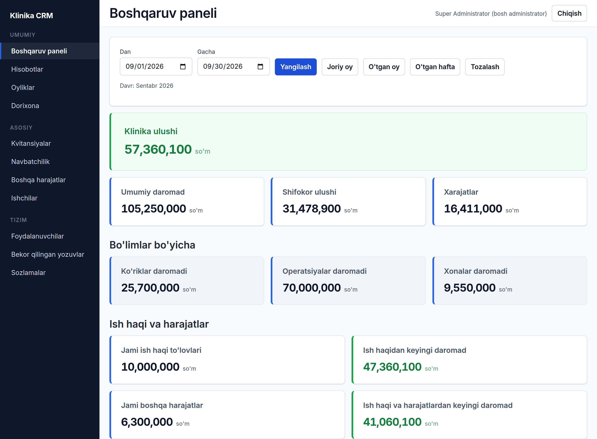
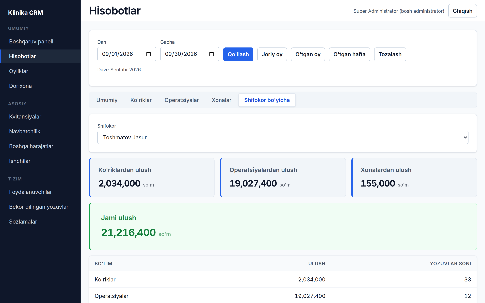
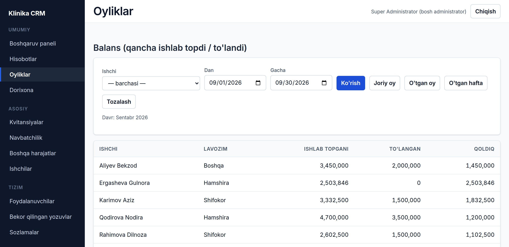
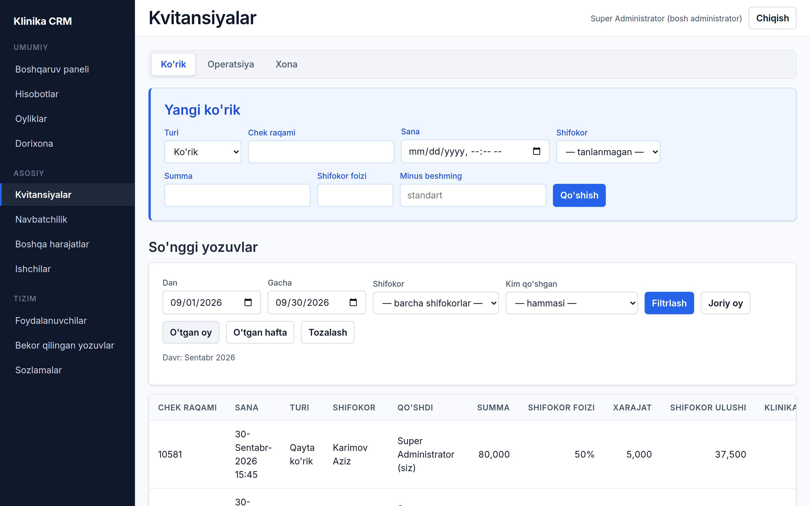
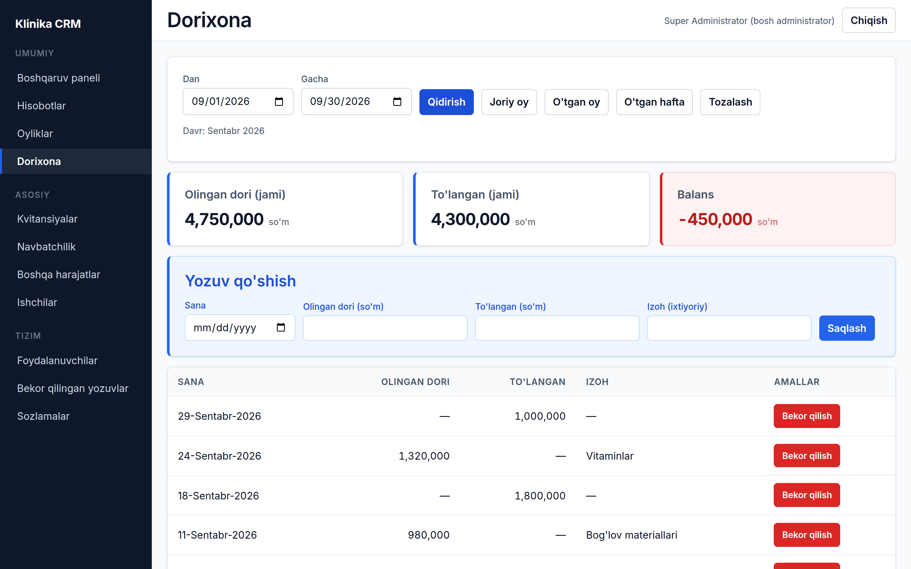
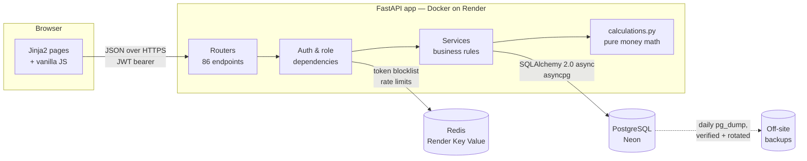

# Clinic CRM — finance, payroll and operations for a private clinic

A web application I designed, built and deployed for a private clinic in Tashkent. It replaced the clinic's Excel spreadsheets and paper records for receipts, doctors' commissions, staff salaries, the pharmacy account and day-to-day expenses.

> **This is a case study.** The source code is private because it is a client project. I'm happy to walk through the code, architecture or tests in an interview. All screenshots below use fictional demo data.

| | |
|---|---|
| **Role** | Sole developer: requirements, data model, backend, frontend, testing, deployment |
| **Timeline** | August – September 2026, in production since September |
| **Backend** | FastAPI (async), SQLAlchemy 2.0 with asyncpg, PostgreSQL, Alembic, Redis, Pydantic v2 |
| **Frontend** | Server-rendered Jinja2 pages with vanilla JavaScript, fully in Uzbek |
| **Hosting** | Docker container on Render, PostgreSQL on Neon, Redis on Render Key Value |
| **Size** | 86 API endpoints · 10 database tables · 10 migrations · 158 automated tests |

---

## The problem

Every visit, surgery and room stay produced a paper receipt. At the end of each month someone had to work out, by hand and in Excel:

- how much each doctor earned: a different percentage of every receipt, after a fixed per-receipt deduction or the surgery's own costs;
- what each nurse and administrator was owed: a fixed monthly salary, prorated for partial months, plus any paid overtime;
- how much had already been paid out as advances, and what was still due;
- the running balance with the pharmacy supplier, and the clinic's other expenses.

It was slow, it was easy to get wrong, and nobody could see the clinic's real position before the month was over.

## What I built

| Module | What it does |
|---|---|
| **Receipts** (*Kvitansiyalar*) | Record consultations (first and follow-up visits), surgeries and room stays. The doctor's share and the clinic's share are calculated automatically and previewed live while typing. |
| **Dashboard** (*Boshqaruv paneli*) | Income, doctors' shares, expenses, the clinic's share, salary payouts and net figures for any period, with one-click "this month / last month / last week" filters. |
| **Reports** (*Hisobotlar*) | Per-department and per-doctor reports for any date range, exportable to Excel. |
| **Payroll** (*Oyliklar*) | Earned vs. paid vs. remaining for every staff member. Doctors earn commission; nurses and staff earn a fixed salary prorated by working day and clamped to their hire date. Advances and full payments are recorded per month. |
| **Overtime** (*Navbatchilik*) | Duty and overtime entries that feed straight into each person's earnings. |
| **Pharmacy** (*Dorixona*) | A running ledger of medicine received vs. paid, with the balance shown in green or red. |
| **Expenses** (*Boshqa harajatlar*) | Utilities, supplies, repairs and other costs, searchable and totalled per period. |
| **Staff and users** | Doctors, nurses and other staff; login accounts with three roles (superadmin, manager, assistant) and block/unblock. |
| **Voided records** | Nothing financial is deleted in normal use: records are voided, stay out of every total, and only the superadmin can restore them or permanently remove them. |

## Screenshots

*Fictional demo data. The interface is in Uzbek, the clinic's working language.*

**Dashboard** — the clinic's position for any period, from gross income down to net after salaries and expenses.

**Per-doctor report** — one doctor's share across consultations, surgeries and room stays.

**Payroll balance** — earned, paid and remaining for every staff member. The nurse hired mid-month is prorated automatically.

<b>More screenshots:</b> receipts, pharmacy ledger

**Receipts** — entry form with live calculation, and the filterable receipt list.

**Pharmacy ledger** — medicine received vs. paid, with the running balance.

## Architecture

Every domain module (staff, finance, duty, salary, pharmacy, expenses, users) follows the same layering: **router → auth/role dependency → service → database**. The money formulas live in small `calculations.py` modules that import nothing from FastAPI or SQLAlchemy, so they can be unit-tested on their own and reused by every report, the dashboard and payroll: there is exactly one implementation of each formula.

## Engineering highlights

**Money has to be exact.** Amounts are whole Uzbek soums stored as `Numeric(12,0)` and calculated with Python `Decimal`. Each receipt is rounded (`ROUND_HALF_UP`) *before* totals are summed, so a report always equals the sum of the receipts in it. That is why reports aggregate in Python rather than with SQL `SUM()`, which would round once at the end and drift. The live preview in the browser uses exact `BigInt` arithmetic and was checked against the server's formulas over 4,013 cases.

**Dates are business dates in Tashkent time.** Reports filter on the date the service happened, not when it was typed in, using an inclusive start and an exclusive end at local midnight. I found and fixed a bug where the browser's `toISOString()` converted "the 1st of the month" to UTC, silently pulling the previous day into every monthly figure.

**Payroll proration.** Fixed salaries are prorated by working day (Sundays excluded), split per calendar month and rounded per month, and never accrue before a person's hire date. A whole month always pays exactly the salary.

**Found and fixed an N+1 query.** The payroll balance issued five queries per staff member. It now issues five in total, and a test proves the batched and per-person paths return identical figures. I also added indexes shaped to the report queries that actually run.

**Role-based access, enforced on the server.** Three roles with a written permission matrix. Assistants can enter receipts but only ever see their own; managers run the clinic day to day; only the superadmin can restore or permanently delete records, change settings or manage managers.

**Security hardening after a full review.** I reviewed the whole project and fixed the findings:

- JWT access and refresh tokens with a unique ID per token. Logout revokes tokens through a Redis blocklist, and blocking a user or changing their password invalidates all of their sessions at once.
- Argon2 password hashing, and rate limits on login (5 per minute) and token refresh.
- A strict Content-Security-Policy, HSTS, clickjacking and MIME-sniffing protection, and API docs switched off in production.
- Stored-XSS protection: every user-entered value is escaped before it reaches the page. I verified the fix in a real browser with a malicious payload.
- A container that runs as a non-root user, pinned dependencies, and secrets kept out of git and rotated.

## Testing

**158 automated tests** with pytest and pytest-asyncio against a real PostgreSQL database and Redis:

- unit tests for every money and payroll formula, with worked examples (one taken straight from the clinic's original spreadsheet);
- service tests for each module: create, update, void, restore, reports and balances;
- 65 HTTP-level tests for authentication, role enforcement, the assistant "own records only" rule and each security fix.

## Deployment and operations

- **Production:** a Docker image on Render, PostgreSQL on Neon and Redis on Render Key Value. The deployment is documented as a step-by-step checklist, including the pitfalls I hit, such as Neon's connection pooler breaking asyncpg's prepared statements.
- **Backups:** Neon's free tier keeps only a few hours of history, so I wrote PowerShell scripts that take a daily `pg_dump`, check that every dump can be read back by `pg_restore`, keep 30 days of dailies plus every 1st-of-month dump permanently, and restore only after an explicit typed confirmation.
- **Migrations:** Alembic, applied before each release.

## What I'd add next

- A CI pipeline that runs the test suite on every push.
- An optional edit history for financial records.
- Scheduled monthly reports emailed to the owner.

---

**Mukhammad Batoshev** — Python backend developer (FastAPI · Django · DRF)
[GitHub profile](https://github.com/Aminovich7) · m.aminovich7@gmail.com · Telegram [@aminovich7](https://t.me/Aminovich7)
